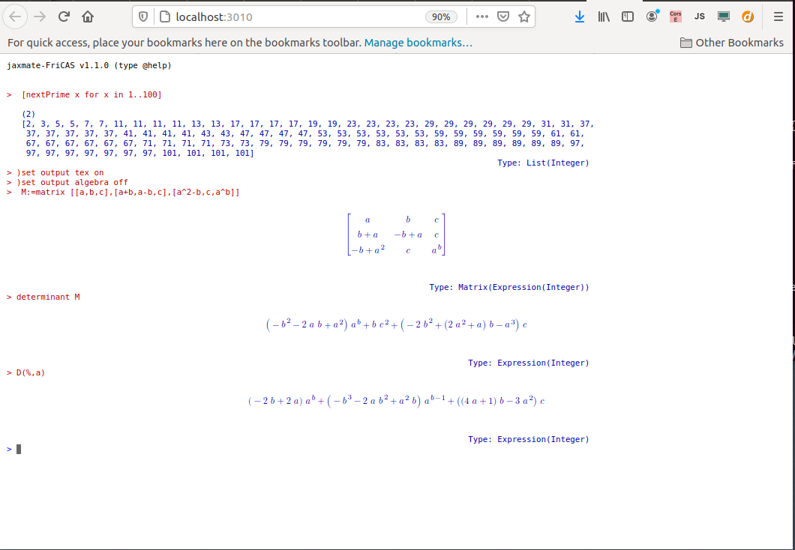
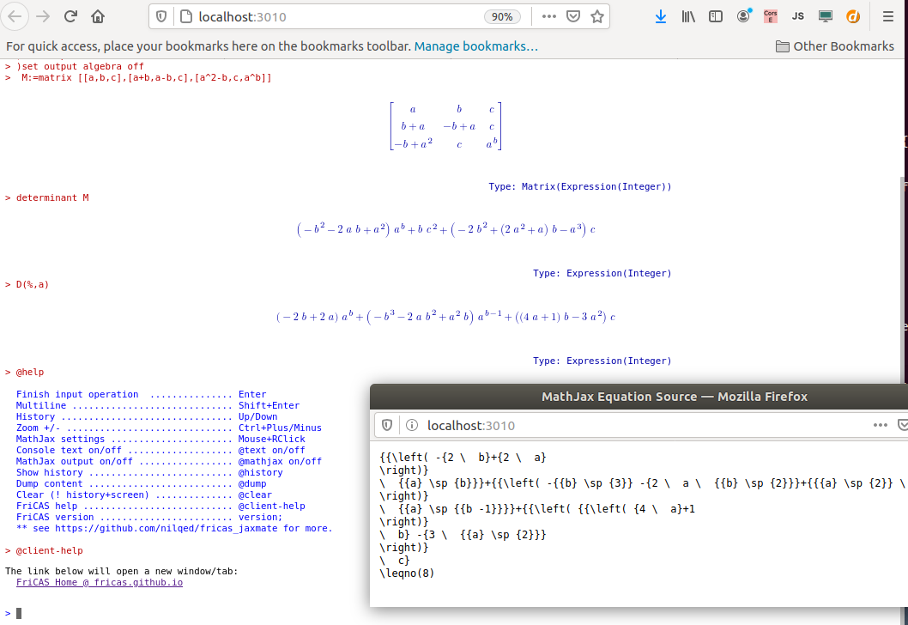

# fricas_jaxmate
FriCAS node server + JaxMaTe client (:warning: :construction:)

Using a variant of [JaxMaTe](https://github.com/nilqed/jaxMaTe) tailored to the [FriCAS Computer Algebra System](https://en.wikipedia.org/wiki/FriCAS).

## Quick install

Required:

* [node.js](https://nodejs.org/en/) (e.g. `sudo apt install nodejs`)
* [fricas](https://fricas.github.io), in path.

Get the repo:

	git clone https://github.com/nilqed/jaxmate_pure.git

Start:

    ./start.sh
    Reload or press the Try-again button.

or step by step:

* `cd fricas_jaxmate`
* `node fricas_server.js`
* open http://localhost:3010, (e.g. `firefox localhost:3010`)

 :heavy_exclamation_mark: Tested with Firefox. 

## Customise

:bell: [todo]

